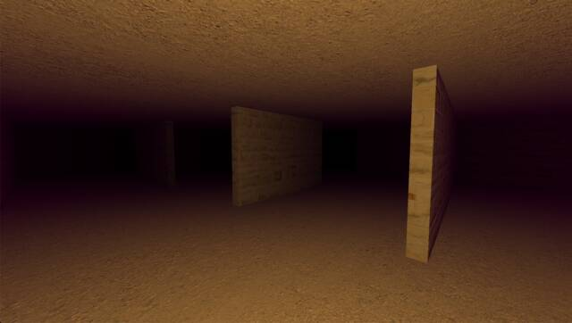

# Maze Walker

Simple 3D maze game with Three.js
Single HTML page with all the code in it. Start an HTTP server from the directory where you cloned the game. Load the html page in your browser by visiting `localhost:<port>/maze-walker.html`

-----

Common problem(s): You may be spawned too close to a wall and there fore unable to move - refresh the page to re-generate the random walls.

-----

Run around and explore

## How to play

Move with WASD and your mouse

Special (dev) features:
- Space will toggle lights on or off
- C to toggle collision detection
- F to toggle Fast mode
- M to toggle wireframe (mesh)

-----

Even with the lights on, you can't quite see to the end of the chamber  

Started: 22 September 2024

Scaffolding put in place by ChatGPT

